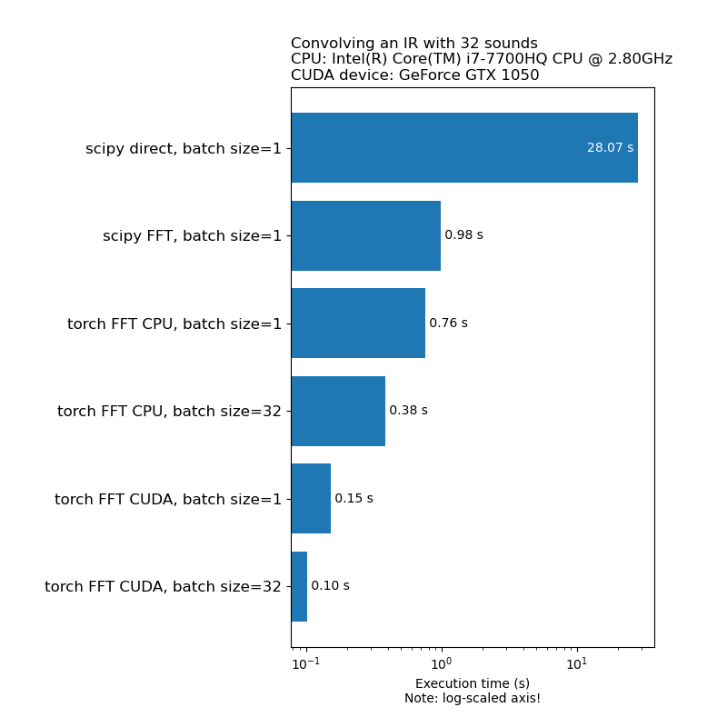

# torch-audiomentations
Audio data augmentation in PyTorch. Inspired by [audiomentations](https://github.com/iver56/audiomentations).

# Setup

`pip install torch-audiomentations`

# Usage example

```python
import torch
from torch_audiomentations import Gain


torch_device = torch.device("cuda" if torch.cuda.is_available() else "cpu")

# Initialize augmentation callable
apply_gain_augmentation = Gain(
  min_gain_in_db=-15.0,
  max_gain_in_db=5.0,
  p=0.5,
).to(device=torch_device)

# Make an example tensor with white noise.
# This tensor represents 8 audio snippets with 2 channels (stereo) and 2 seconds of 16 kHz audio.
audio_samples = torch.rand(size=(8, 2, 32000), dtype=torch.float32, device=torch_device) - 0.5

# Apply gain augmentation. This varies the gain of (some of) the audio snippets in the batch independently.
perturbed_audio_samples = apply_gain_augmentation(audio_samples, sample_rate=16000)
```

# Contribute

Contributors welcome! 
[Join the Asteroid's slack](https://join.slack.com/t/asteroid-dev/shared_invite/zt-cn9y85t3-QNHXKD1Et7qoyzu1Ji5bcA)
to start discussing about `torch-audiomentations` with us.

# Motivation: Speed

We don't want data augmentation to be a bottle neck in model training speed. Here is a
comparison of the time it takes to run 1D convolution:



# Current state

torch-audiomentations is in a very early development stage, so it's not ready for prime time yet.
Meanwhile, star the repo and stay tuned!

# Version history

## v0.1.0 (2020-10-12)

Initial release with `Gain` and `PolarityInversion`

# Development

## Setup

A GPU-enabled development environment for torch-audiomentations can be created with conda:

* `conda create --name torch-audiomentations python=3.7.3`
* `conda activate torch-audiomentations`
* `conda install pytorch cudatoolkit=10.1 -c pytorch`
* `conda env update`

## Run tests

`pytest`

## Conventions

* Format python code with [black](https://github.com/psf/black)
* Use [Google-style docstrings](https://google.github.io/styleguide/pyguide.html#381-docstrings)
* Use explicit relative imports, not absolute imports

# Acknowledgements

The development of torch-audiomentations is kindly backed by [Nomono](https://nomono.co/)
